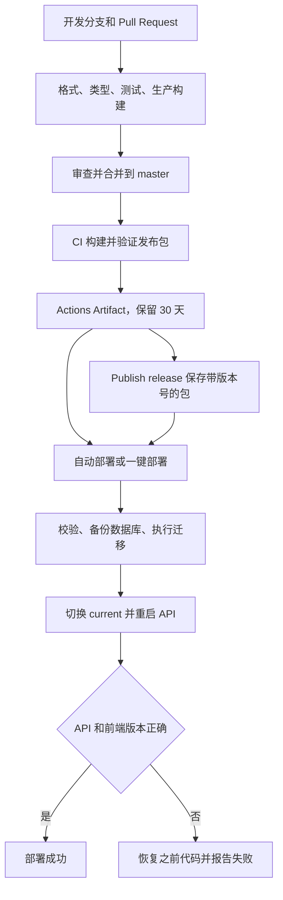

# AutoMatic CI/CD 操作与学习指南

本项目使用 GitHub Actions，仓库为 `slang-l/AutoMatic`，主分支为 `master`，生产地址为 <https://180.76.248.209>。保留现有 Ubuntu 24.04、Node.js 22、pnpm 9.15.4、Nginx、systemd 和 PostgreSQL 17 部署方式。

这次改造提供验证、部署、正式版本发布、回滚和版本查询入口。**构建一次，通过验证后重复使用同一个发布包**。服务器只校验、备份、迁移和切换版本，不重新安装应用依赖或编译。

## 1. 配置完成后的日常命令

在项目根目录执行：

```powershell
pnpm ci:local                       # Docker 中完整验证本地工作区，不发布
pnpm ci:run                         # 在 GitHub 验证并构建远端 master
pnpm deploy:prod                    # 部署远端 master 当前提交的成功 CI 包
pnpm release 1.2.3                  # 创建 v1.2.3 Release，并部署这个包
pnpm release 1.2.4 --no-deploy       # 只保存正式版本，暂不上线
pnpm deploy:prod --tag v1.2.3        # 使用已有 Release 包再次部署
pnpm deploy:prod --run 123456789     # 部署指定成功 CI Run 的包
pnpm rollback                       # 回滚服务器记录的上一版代码
pnpm rollback RELEASE_ID            # 回滚服务器保留的指定版本
pnpm deploy:status                  # 查询当前、上一版和服务器保留版本
pnpm cicd --help                    # 查看完整帮助
```

部署命令是 **`pnpm deploy:prod`**。`pnpm deploy` 是 pnpm 自带的依赖打包命令，不是本项目的上线入口。

除 `ci:local` 外，这些命令操作 GitHub 上的代码，默认等待 Actions 结束，在失败时返回非零退出码。输出的任务链接可查看 Summary 和日志。`--no-wait` 只触发任务，不代表部署完成。

本地有未提交文件，或本地 HEAD 与远端 `master` 不同时，`ci:run`、默认部署和 `release` 会拒绝执行，避免误以为本地修改已经上线。明确只操作远端时可加 `--remote`：

```powershell
pnpm deploy:prod --remote
pnpm release 1.2.3 --remote
```

`--remote` 不上传本地文件。指定标签、指定 Run、回滚和状态查询已经明确目标，不要求工作区干净。

## 2. 不使用终端也能一键操作

打开 [GitHub Actions](https://github.com/slang-l/AutoMatic/actions)，选择工作流，点击 **Run workflow**，分支均选择 `master`。

| 工作流                  | 输入                               | 结果                                           |
| ----------------------- | ---------------------------------- | ---------------------------------------------- |
| **CI**                  | 可选备注                           | 验证、构建并保存当前 master 发布包，不自动上线 |
| **Deploy production**   | source=latest，reference 留空      | 部署当前 master 成功 CI 的包                   |
| **Deploy production**   | source=run，reference 填 CI Run ID | 部署指定成功构建，不重建                       |
| **Deploy production**   | source=tag，reference 填 v1.2.3    | 从 GitHub Release 下载版本并部署               |
| **Publish release**     | version 填 1.2.3，deploy 勾选      | 创建标签、保存已验证包，然后部署               |
| **Publish release**     | version 填 1.2.3，deploy 取消勾选  | 仅保存版本                                     |
| **Rollback production** | release 留空或填 previous          | 回滚上一版代码                                 |
| **Rollback production** | release 填服务器已有发布编号       | 回滚指定保留版本                               |
| **Production status**   | 无必填项                           | 在 Summary 显示当前、上一版和保留版本          |

默认部署和正式版本发布只选择 **master 当前提交** 的成功构建。如果正在构建，最多等待 10 分钟；如果失败、没有构建或包过期，会报错，不拿较旧提交代替。此时先运行 **CI**，成功后重试。

## 3. 理解 CI 与 CD

CI 是持续集成：提交后自动检查代码、测试数据库操作并构建，尽早发现问题。CD 是持续部署：把验证过的包传到服务器，完成备份、迁移、切换和健康检查。



PR 执行格式、类型、单元测试、PostgreSQL 集成测试和生产构建，不打生产发布包、不使用生产 SSH 凭据。master CI 再打包，验证包内的生产入口和依赖。

推送或合并到 master 后，**成功的 push CI** 会触发自动部署，前提是仓库变量 `DEPLOY_ENABLED=true` 且 `AUTO_DEPLOY` 没有设为 `false`。手动运行 **CI** 只构建；随后从部署或发布入口选择是否上线。

部署工作流直接下载成功 CI 的包。正式版本发布也复用这个包：先建草稿，上传 tar.gz、SHA256、清单，全部完成后公开 Release，再显式调用部署工作流。

## 4. 首次启用：提交代码

本次开发没有自动提交、推送、配置 GitHub Secrets 或切换生产服务。当前工作区的文章持久化、路由等修改，如需一起发布，应连同依赖和锁文件审查后提交。

```powershell
git status --short
git diff
node scripts/apply-blocksuite-patches.mjs
pnpm install --frozen-lockfile
pnpm ci:local
```

`ci:local` 需要运行中的 Docker，首次会下载测试镜像和依赖。在 Linux 容器中复制工作区，排除 `.env`、本机依赖和临时文件，创建独立 PostgreSQL，不占用主机数据库端口。结束后清理本次创建的容器和网络，验证包保存在 `.tmp/cicd-linux/`。

本地包的 `source=working-tree`，仅用于验证，不能经正式发布入口冒充已提交构建。GitHub CI 使用真实提交 SHA 和 `source=git`。

创建分支，选择确认过的文件提交：

```powershell
git switch -c feat/cicd-release-controls
git add .github ops scripts package.json README.md docs/ci-cd.md docs/deployment.md
# 应用功能和锁文件如需一起上线，请审查后另外 git add 对应文件。
git diff --cached
git commit -m "feat: add one-command release deployment and rollback"
git push -u origin feat/cicd-release-controls
```

创建目标为 master 的 PR，确认 **Verify and package** 通过后合并。工作流文件必须进入默认分支，手动入口和本地命令才可调用。

BlockSuite 使用固定上游提交的子模块。两处已有修复保存在 `patches/blocksuite/`，Actions 检出后运行补丁脚本。无需 reset 子模块；后续新增修改应保存为补丁，或提交到可访问的 fork 再更新父仓库指针，不能只保留本地 dirty 状态。

## 5. 首次启用：升级服务器发布命令

新功能需要安装这次更新的 `ops/automatic-release.sh`。普通应用发布不会覆盖 root 所有的管理脚本；`status`、`rollback previous` 和重复部署需要升级后才能使用。

当前电脑之前生成的专用文件为：

```text
C:\Users\Admin\.ssh\automatic-github-actions
C:\Users\Admin\.ssh\automatic-github-actions.pub
C:\Users\Admin\.ssh\automatic-production-known-hosts
```

依次为私钥、公钥和此前通过可信连接核验过的主机公钥。私钥不在项目内。将新 ops 和公钥上传，在管理员会话安装：

```powershell
scp -r ops root@180.76.248.209:/tmp/automatic-cicd-ops
scp "$env:USERPROFILE\.ssh\automatic-github-actions.pub" root@180.76.248.209:/tmp/automatic-github-actions.pub
ssh root@180.76.248.209
```

服务器执行：

```bash
sudo bash /tmp/automatic-cicd-ops/bootstrap-cicd.sh /tmp/automatic-github-actions.pub
sudo /usr/local/sbin/automatic-release status
```

bootstrap 可重复运行，安装发布命令、`automatic-deploy` 专用账号、受限公钥和唯一 sudo 入口；API 仍由 `automatic` 运行，安装本身不重启 API。如果上传目标已存在，先确认新脚本实际路径。

服务器要求 Python 3.12+、Node.js 22、curl、Docker Compose 和现有 Nginx/systemd 配置。共享 API 配置、compose、数据卷和 JWT 密钥沿用已有值。

如改为域名，同时配置 DNS、Nginx、证书和 `CORS_ORIGINS`，由 root 将 `/etc/automatic/release.conf` 内容改为：

```bash
public_url=https://app.example.com
```

文件属于 root，普通账号不可写。GitHub `DEPLOY_URL` 应与其一致。保留 IP 时不用修改，默认 `https://180.76.248.209`。

新服务器应单独生成部署密钥，并通过可信连接核验主机公钥。非默认 SSH 端口的 known_hosts 名称使用 `[180.76.248.209]:端口`。不关闭主机公钥校验，不把密码写进工作流。

## 6. 首次启用：配置 GitHub

### 6.1 Actions 与 production

**Settings → Actions → General** 允许工作流，以及项目引用的 `actions/*`、`pnpm/action-setup`。第三方 Action 已固定具体提交 SHA。

**Settings → Environments** 创建 `production`，允许部署分支限制为 master。如果需要审批，可按 GitHub 套餐可用功能设置 Required reviewers；未设置审批时可以自动上线。

### 6.2 Environment Secrets

| production Secret  | 内容                                                     |
| ------------------ | -------------------------------------------------------- |
| DEPLOY_SSH_KEY     | automatic-github-actions 私钥完整内容，包含 BEGIN/END 行 |
| DEPLOY_KNOWN_HOSTS | 已核验的 automatic-production-known-hosts 完整内容       |

PowerShell 复制文件后粘贴到对应 Secret：

```powershell
Get-Content "$env:USERPROFILE\.ssh\automatic-github-actions" -Raw | Set-Clipboard
Get-Content "$env:USERPROFILE\.ssh\automatic-production-known-hosts" -Raw | Set-Clipboard
```

每条命令后分别粘贴，再执行下一条。数据库、JWT、邮件和微信配置继续保存在服务器，不需要交给 GitHub。

### 6.3 Variables

| 位置                   | 名称           | 值及用途                                                   |
| ---------------------- | -------------- | ---------------------------------------------------------- |
| 仓库 Actions Variables | DEPLOY_ENABLED | 初始 false；服务器和 Secrets 就绪后改 true，启用部署和回滚 |
| 仓库 Actions Variables | AUTO_DEPLOY    | 默认开启；填 false 改为仅手动上线                          |
| production Variables   | DEPLOY_HOST    | 180.76.248.209                                             |
| production Variables   | DEPLOY_PORT    | 可选，默认 22                                              |
| production Variables   | DEPLOY_URL     | 可选，默认 https://180.76.248.209，支持 HTTPS 域名         |

DEPLOY_ENABLED、AUTO_DEPLOY 必须放在仓库级，来源解析发生在进入 production 之前。先保持 DEPLOY_ENABLED=false 验证 CI；再设 AUTO_DEPLOY=false、DEPLOY_ENABLED=true，手动部署验收，最后决定是否开启自动部署。

### 6.4 终端的一次性登录

安装 GitHub CLI，在自己的终端执行：

```powershell
gh auth login
gh auth status
pnpm cicd --help
```

也可在终端设置 `GH_TOKEN`，令牌仅授权本仓库，需要 **Actions: write** 和 **Contents: read**。不保存到项目或 Git。创建 Release 的写权限由工作流自身的 GITHUB_TOKEN 提供。

命令从 origin 推断仓库；可用 `GITHUB_REPOSITORY=owner/repository` 明确指定。默认等待最多 45 分钟，超时不会取消远端任务，应先查看状态再重试。

## 7. 每次开发、发布的步骤

### 7.1 开发与 PR

```powershell
git switch master
git pull --ff-only
git submodule update --init --recursive
node scripts/apply-blocksuite-patches.mjs
git switch -c feat/your-feature
# 开发功能。
pnpm format:check
pnpm ci:local
git add <本次确认的文件>
git commit -m "feat: describe the change"
git push -u origin feat/your-feature
```

创建 PR → 等待 CI → 审查 → 合并。自动部署开启时，观察 **CI** 和随后 **Deploy production** 两个独立工作流，两者成功才是完成上线。建议 master Ruleset 要求 PR、Verify and package 成功，并禁止 force push。

### 7.2 快速更新线上

代码合并且 CI 成功后：

```powershell
git switch master
git pull --ff-only
pnpm deploy:prod
```

不会重建应用。同一包已上线且健康时直接返回成功，不再次重启。

### 7.3 保存正式版本

```powershell
pnpm release 1.2.3
```

创建标签 v1.2.3、带更新说明的 GitHub Release 和验证包，然后部署。标签是版本名称，服务器编号仍是来源 CI 编号，不要求各 package.json 版本号同步。

版本采用语义化版本：修复如 1.2.4，兼容新功能如 1.3.0，不兼容变更如 2.0.0，候选版本如 1.3.0-rc.1。公开版本不能覆盖；再次部署使用 `deploy:prod --tag`，修改内容使用新版本号。

Actions 包保留 30 天，长期需要重新部署的版本保存为 Release。Release 仍校验标签 SHA 和成功 CI 记录，不要手工删除其来源 workflow run 或移动标签。

上传中断保留草稿，同一来源包可重试；已有文件必须逐字节一致。如果 master 已更新或草稿属于不同构建，先检查草稿后选择新版本，脚本不覆盖文件。

### 7.4 回滚

```powershell
pnpm deploy:status
pnpm rollback
```

回滚后上一版指针更新为刚离开的版本，再次回滚可切回。指定版本使用 `pnpm rollback RELEASE_ID`。操作服务器本地 release，无需下载或构建；重复指定当前健康版本不重启、不丢失上一版。

如果 master 仍有待完成的自动部署，新任务可能覆盖回滚，应先关闭 AUTO_DEPLOY 并修复有问题的提交。

**回滚只恢复代码，不恢复数据库。** 迁移应向前兼容：先加表/字段，逐步迁移代码，最后另行删除旧结构。恢复备份可能丢失新数据，按 [部署与备份说明](deployment.md) 单独评估。

## 8. 验证和部署内部机制

CI 固定依赖安装，执行 ShellCheck、格式、类型、前后端测试和生产构建。临时 PostgreSQL 使用 automatic_ci 数据库，实际运行文章与协同集成测试。

隔离部署测试验证故障后恢复代码、上一版回滚、状态、重复部署、同编号不同包拒绝、迁移失败重试和备份不覆盖，不使用生产目录、服务和数据。

master CI 用 pnpm 9 的 `--filter @automatic/api deploy --prod` 创建包含 Linux 生产依赖的独立目录，检查符号链接在包内，再打包前端、API、迁移和 release.json。解开同一包启动生产入口，验证数据库迁移、版本身份、登录、Secure/HttpOnly Cookie、续期和退出。

发布编号例如 `123456789-1-a1b2c3d4e5f6`，依次为 Run ID、attempt、SHA 前 12 位。保存文件与包内结构：

```text
123456789-1-a1b2c3d4e5f6.tar.gz
123456789-1-a1b2c3d4e5f6.sha256
123456789-1-a1b2c3d4e5f6.json

# 归档内：
release.json
apps/api/{package.json,dist,migrations,node_modules}
apps/web/dist/{index.html,assets,version.json}
```

来源校验拒绝 PR、其他分支、外部仓库和失败任务。默认部署排队后还会核对 master SHA，避免旧自动任务覆盖新提交。指定 Run/标签是明确选择，可部署历史版本。

服务器用 flock 串行化发布/回滚，GitHub 共用 automatic-production 并发组。依次校验、安全解包、链接共享配置、备份数据库与配置、迁移、保留旧 hash 静态资源、切换 current、重启 API，检查 API 和 Nginx 前端 release/commit；工作流再从公网验证两者。

新版本保存归档指纹，同编号不同内容会拒绝；迁移失败可重试同一包。每次尝试独立备份，不覆盖之前文件。无指纹的老版本可以回滚；部署旧包遇到目录冲突时，应重跑 CI 生成新编号。

切换后服务器健康检查失败会恢复之前代码，任务仍失败。公网检查失败也报告失败，但不盲目再次切换，应排查网络、证书或代理。迁移不自动撤销，已经执行的 SQL 文件不能修改。

单实例 API 有短暂重启窗口，内存验证码也会失效。零停机需要第二个实例和就绪后流量切换，属于后续架构工作。

## 9. 排查与首次验收

| 现象                   | 处理                                                     |
| ---------------------- | -------------------------------------------------------- |
| 未提交或与远端不同     | 提交并合并；明确操作远端时加 --remote                    |
| workflow 404           | 确认已合并到默认分支，令牌授权正确仓库                   |
| 没有成功包或已过期     | 运行 ci:run，或部署已保存的 Release                      |
| 自动部署 skipped       | 检查 push/master、DEPLOY_ENABLED/AUTO_DEPLOY 和最新 SHA  |
| 手动部署未启用         | 配置 Secrets 和仓库 DEPLOY_ENABLED=true                  |
| Environment 等待       | 检查审核和允许部署分支                                   |
| 主机公钥失败           | 核验公钥、端口后更新 Secret，不关闭校验                  |
| SSH 拒绝或超时         | 检查公钥、用户名、端口、百度云安全组                     |
| status/previous 不支持 | bootstrap 升级服务器发布命令                             |
| 迁移失败               | 查看连接、迁移校验和日志；切换前不会替换服务             |
| 健康检查失败           | 查看恢复结果和 journalctl -u automatic-api -n 100        |
| API/前端版本不同       | 检查 current、release.env、Nginx、域名及缓存             |
| ci:local 无法启动      | 启动 Docker，检查镜像/依赖网络，使用 Python 3.12/Node 22 |
| 锁文件或补丁失败       | 修正并一起提交，不自动 reset 子模块                      |

首次验收：PR 的 Verify and package 成功；master CI 和 Deploy production 成功；公网两个接口返回相同 release/commit；页面、登录和文章保存可用；Production status 正确列版本；必要时验证回滚且数据保留。

```powershell
curl.exe https://180.76.248.209/api/health
curl.exe https://180.76.248.209/version.json
pnpm deploy:status
```

原有每日备份在 `/var/backups/automatic`，部署前备份独立保存。旧 release、incoming 和静态资源不自动删除，应监控磁盘，保留当前、上一版及需要回滚的版本。数据库文章进入备份，浏览器尚未上传的修改仍需保留；备份应另存独立存储。

## 10. 文件入口和官方资料

2026-10-07 本地隔离验证通过：Ubuntu 24.04 / Node.js 22 / PostgreSQL 17 下运行完整 `pnpm ci:local`，39 项 API、30 项前端、14 项 CI/CD 测试全部成功，无跳过；类型检查、生产构建、ShellCheck、发布/回滚恢复测试及实际发布包启动验证成功。五个工作流也通过 Actionlint 静态检查。这些结果不替代首次真实 GitHub/服务器上线验收。

| 文件                                              | 用途                         |
| ------------------------------------------------- | ---------------------------- |
| .github/workflows/ci-cd.yml                       | 验证、构建、打包             |
| .github/workflows/deploy.yml                      | 自动/手动部署及复用          |
| .github/workflows/release.yml                     | 创建版本，可选部署           |
| .github/workflows/rollback.yml                    | 回滚                         |
| .github/workflows/status.yml                      | 查询生产版本                 |
| scripts/cicd.mjs                                  | 本地一键命令，等待并报告结果 |
| scripts/lib/                                      | GitHub API、来源和归档校验   |
| ops/automatic-release.sh                          | 服务器发布、状态、回滚       |
| ops/bootstrap-cicd.sh                             | 安装/升级发布命令            |
| scripts/test-linux-ci.mjs、ops/verify-linux-ci.sh | 本地 Docker 完整验证         |

- [workflow_run：CI 完成后触发部署](https://docs.github.com/en/actions/reference/workflows-and-actions/events-that-trigger-workflows#workflow_run)
- [下载指定工作流的 artifact](https://docs.github.com/en/actions/how-tos/manage-workflow-runs/download-workflow-artifacts)
- [API 触发工作流](https://docs.github.com/en/rest/actions/workflows#create-a-workflow-dispatch-event)
- [创建 GitHub Release](https://docs.github.com/en/rest/releases/releases#create-a-release)
- [Environments 与保护规则](https://docs.github.com/en/actions/reference/workflows-and-actions/deployments-and-environments)
- [Actions Secrets 配置](https://docs.github.com/en/actions/how-tos/write-workflows/choose-what-workflows-do/use-secrets)

首次提交、GitHub 配置、服务器命令升级后流程才会生效。本地测试通过不等于真实 GitHub 部署已完成。
