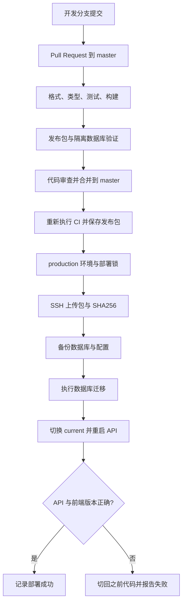

# AutoMatic CI/CD 操作与学习指南

本项目使用 GitHub Actions，仓库是 `slang-l/AutoMatic`，主分支是 `master`，生产地址是 <https://180.76.248.209>。沿用现有 Nginx、systemd、PostgreSQL 17 和 Node.js 22，不要求重建服务器或切换容器架构。

CI/CD 配置已经写入本地仓库。GitHub 上的运行需要先提交、推送这些文件，并配置下面的 Environment、Secrets 和 Variables。服务器准备和本地验证不能代替一次实际的 GitHub Actions 运行。

## 1. 先理解 CI、CD 各自做什么

**CI（持续集成）**：提交代码后，自动检查格式、类型、测试、数据库集成和生产构建，尽早发现问题。

**CD（持续部署）**：仅当 CI 全部成功，并且代码来自 `master` 时，将 CI 验证过的发布包部署到生产。

这里默认支持自动部署。你也可以在 GitHub 的 `production` Environment 中设置部署审核；审核人功能是否可用取决于仓库可见性和 GitHub 套餐。



PR 会执行检查并生成发布包，**不会拿到生产 SSH 密钥，也不会部署**。部署 job 还要求 `DEPLOY_ENABLED=true`，因此可以先启用 CI，再启用自动部署。

## 2. 项目中新增的文件

| 文件                                     | 职责                                                    |
| ---------------------------------------- | ------------------------------------------------------- |
| `.github/workflows/ci-cd.yml`            | PR/master 检查、Linux 构建、打包、生产部署              |
| `.github/workflows/rollback.yml`         | 手动回滚到服务器已有版本                                |
| `.github/actions/prepare-ssh/action.yml` | 配置专用 SSH 密钥与已验证的服务器主机公钥               |
| `.gitmodules`                            | 让全新克隆可以拉取 BlockSuite 子模块                    |
| `patches/blocksuite/*.patch`             | 保存原先只存在本地的两处 BlockSuite 修正                |
| `scripts/apply-blocksuite-patches.mjs`   | 应用补丁；已应用则跳过，冲突则报错                      |
| `ops/package-release.sh`                 | 打包前端、API、迁移和 API 生产依赖，生成元数据与 SHA256 |
| `scripts/smoke-release.mjs`              | 对实际发布包运行 PostgreSQL、登录、续期、退出测试       |
| `ops/bootstrap-cicd.sh`                  | 一次性准备专用部署账号、SSH 公钥、sudo 和 systemd 配置  |
| `ops/automatic-release.sh`               | 服务器上的校验、备份、迁移、切换、检查和回滚            |

服务器使用的是已安装到 `/usr/local/sbin/automatic-release` 的 root 所有脚本。普通发布包不包含新的 root 部署脚本；修改 `ops/automatic-release.sh` 后，需要管理员审查并重新执行 bootstrap 安装它。

## 3. 为什么必须先处理 BlockSuite

根仓库将 `packages/blocksuite` 记录为 Git 子模块，固定在 `8aed732697d88d4257c3aa706f3d47c942cd7420`。原先缺少 `.gitmodules`，两处修改也没有被父仓库保存，直接让 CI checkout 会漏掉它们。

现在采用“上游固定提交 + 父仓库中的补丁”，无需先创建自己的 BlockSuite fork：

1. Actions 使用 `submodules: recursive` 拉取上游固定提交。
2. 执行 `node scripts/apply-blocksuite-patches.mjs`。
3. 修复编辑器的字段初始化问题，并将 `openai` 固定为 `4.47.2`，与现有锁文件一致。
4. 再执行 `pnpm install --frozen-lockfile`。

你的现有子模块修改已与这两份补丁一致，脚本会跳过它们，不会 reset 工作区。

以后升级 BlockSuite：先选择新的上游提交，再重新检查补丁、更新锁文件并跑完整 CI。不要把子模块中的更多未提交修改当作 CI 能自动获取的代码。较多长期改动可以再迁移到自己的 fork。

## 4. 一次性准备部署密钥和服务器

已在当前电脑生成专用密钥，位置为：

```text
C:\Users\Admin\.ssh\automatic-github-actions
C:\Users\Admin\.ssh\automatic-github-actions.pub
C:\Users\Admin\.ssh\automatic-production-known-hosts
```

第一个文件是私钥，第二个是公钥，第三个是经过已有 SSH 连接验证的服务器主机公钥。私钥未放入项目，也不会被 Git 提交。电脑上的私钥已限制为当前用户可访问。

首次准备其他服务器时，在自己的电脑生成不同密钥：

```powershell
ssh-keygen -t ed25519 -C "automatic-github-actions" -f "$env:USERPROFILE\.ssh\automatic-github-actions"
```

CI 使用无人值守密钥，生成时不要设置口令。将公钥和 `ops` 目录上传到服务器，在服务器执行：

```bash
sudo bash ops/bootstrap-cicd.sh /path/to/automatic-github-actions.pub
```

bootstrap 会：

1. 创建 `automatic-deploy`，API 仍由 `automatic` 运行。
2. 将公钥写入专用账号，设置 SSH `restrict`，关闭此密钥的转发和 PTY。
3. 创建 `/srv/automatic/incoming`，供部署账号上传文件。
4. 将发布脚本安装为 root 所有、普通账号不可修改。
5. 只允许部署账号 sudo 执行 `automatic-release`，不授予通用 root shell 或 Docker 权限。
6. 为 API 添加 `release.env`，用于显示当前发布编号与 Git 提交。

部署账号拥有发布任意应用版本的能力；发布代码仍由权限较低的 `automatic` 执行。保管密钥时应按生产部署凭据管理。

从可信的管理员连接获取服务器 ED25519 主机公钥：

```bash
awk '{print "180.76.248.209 " $1 " " $2}' /etc/ssh/ssh_host_ed25519_key.pub
```

将这整行保存为 known_hosts 内容。不要关闭 `StrictHostKeyChecking`，也不要在每次 CI 运行时盲目信任临时扫描结果。

## 5. 在 GitHub 配置生产环境

打开仓库 `https://github.com/slang-l/AutoMatic`，按以下步骤操作。

### 5.1 开启 Actions

进入 **Settings → Actions → General**，允许工作流运行以及本项目引用的 `actions/*` 和 `pnpm/action-setup`。项目已将第三方 Action 固定到具体提交 SHA。

### 5.2 创建 production Environment

进入 **Settings → Environments → New environment**，名称填写 `production`。

将 Deployment branches and tags 限制为 `master`。如果需要人工确认后上线，并且当前套餐支持，可设置 Required reviewers；不设置审核则 CI 成功后自动部署。

### 5.3 配置 Environment Secrets

在 `production` 的 Environment secrets 中添加：

| 名称                 | 值                                                                |
| -------------------- | ----------------------------------------------------------------- |
| `DEPLOY_SSH_KEY`     | 本机 `automatic-github-actions` 私钥的完整内容，包含 BEGIN/END 行 |
| `DEPLOY_KNOWN_HOSTS` | `automatic-production-known-hosts` 的完整内容                     |

在 PowerShell 复制私钥到剪贴板，粘贴到 GitHub 的 Secret 输入框：

```powershell
Get-Content "$env:USERPROFILE\.ssh\automatic-github-actions" -Raw | Set-Clipboard
```

复制 known_hosts：

```powershell
Get-Content "$env:USERPROFILE\.ssh\automatic-production-known-hosts" -Raw | Set-Clipboard
```

不要把私钥、服务器密码或生产 `.env` 写进 workflow、issue、PR 或仓库文件。

### 5.4 配置 Variables

| 位置                                                   | 名称             | 值                                     |
| ------------------------------------------------------ | ---------------- | -------------------------------------- |
| production → Environment variables                     | `DEPLOY_HOST`    | `180.76.248.209`                       |
| Settings → Secrets and variables → Actions → Variables | `DEPLOY_ENABLED` | 先填 `false`，CI 验证成功后改为 `true` |

`DEPLOY_ENABLED` 必须是**仓库级变量**，因为部署 job 的 `if` 在进入 production 环境之前就会执行。

生产数据库密码、JWT 密钥、Resend 和微信配置继续保留在服务器 `/srv/automatic/shared/api.env`。GitHub 不需要获得这些业务密钥。

## 6. 第一次把这套配置提交到 GitHub

当前工作区还有已经部署过、但尚未提交的 UI 与锁文件修改。先检查，确保希望上线的源码、`apps/web/package.json` 和 `pnpm-lock.yaml` 一起进入提交，否则 CI 构建的页面会与服务器当前版本不同。

```powershell
Set-Location D:\code\AutoMatic
git status --short
git diff
node scripts/apply-blocksuite-patches.mjs
pnpm install --frozen-lockfile
pnpm format:check
pnpm check
```

本地没有独立 PostgreSQL 测试库时，协同数据库测试会跳过；GitHub CI 配置了隔离 PostgreSQL，这个测试会实际运行。

创建开发分支并分批添加：

```powershell
git switch -c chore/ci-cd
git add .github ops scripts patches .gitmodules .gitattributes docs/ci-cd.md
git add README.md docs/deployment.md apps/api/package.json apps/api/src/routes/health.ts
# 审查并加入确认要发布的前端及锁文件修改，包括未跟踪的新 UI 文件。
git add apps/web pnpm-lock.yaml
git diff --cached --stat
git diff --cached
git commit -m "chore: add verified artifact deployment pipeline"
git push -u origin chore/ci-cd
```

子模块 HEAD 没有改变，两处本地修改由补丁保存，因此不需要把子模块的 dirty 状态提交到上游。不要将整个本地目录或 `.tmp` 上传到 GitHub。

在 GitHub 创建 PR，目标分支选择 `master`，查看 **Checks → Verify and package**。全部成功后合并。再将 `DEPLOY_ENABLED` 改为 `true`，打开 **Actions → CI and Deploy → Run workflow**，选择 `master`，执行第一次正式发布。

## 7. 每次 CI 如何验证

CI 在 Ubuntu 24.04、Node.js 22、pnpm 9.15.4 中执行：

1. 检出父仓库和指定提交的子模块，应用补丁。
2. 使用 `--frozen-lockfile` 安装依赖，防止 CI 偷偷改变依赖版本。
3. ShellCheck 检查部署脚本，Prettier 检查项目格式，并通过 `ops/test-release-recovery.sh` 用隔离服务验证健康检查失败后的自动代码恢复；测试不连接生产服务或生产数据库。
4. `pnpm check` 执行类型检查、后端测试、8 项已有的前端状态测试和生产构建。
5. PostgreSQL 服务使用 `automatic_ci` 独立数据库，运行原先会跳过的协同测试。
6. `pnpm deploy --prod` 将 API 与生产依赖放入独立目录，修正 pnpm 9 的工作区自引用链接，并检查所有运行依赖链接都位于包内。
7. 打包已经构建的前端、API、迁移、运行依赖和 `release.json`。
8. 解开**同一份发布包**，在隔离数据库运行它，验证真实迁移、发布身份、登录、Secure/HttpOnly Cookie、续期、退出。
9. 保存 tar.gz 与 SHA256，保留 14 天。只有全部成功，部署 job 才会开始。

发布包结构：

```text
release.json
apps/
  api/
    package.json
    dist/
    migrations/
    node_modules/       Linux 上生成的生产依赖，包含包内的 pnpm store
  web/
    dist/
      index.html
      assets/
      version.json
```

不包含生产 `.env`，也不复制 Windows 的 `node_modules` 到 Linux。服务器无需重新执行依赖安装、TypeScript 编译或 Vite 构建，减少内存和外网依赖。

## 8. 服务器如何发布

发布编号形如 `123456789-1-a1b2c3d4e5f6`，依次表示 GitHub Run ID、重试次数和提交 SHA 前 12 位。

服务器先通过 `flock` 串行化发布与回滚，避免 GitHub、手动 SSH 同时修改 `current`。GitHub 部署 job 本身也使用相同的 concurrency group，且不会主动中断正在发布的任务。

发布过程：

1. 复制上传文件到 root 私有临时目录，并检查 SHA256。
2. 拒绝路径穿越、逃逸链接、不期望的内容和超限归档，检查平台与 Node 主版本。
3. 解包到新的 `/srv/automatic/releases/发布编号`，运行代码目录设为 root 所有。
4. 将 API `.env` 链接到原来的共享配置，保留已有 JWT 和数据库凭据。
5. 在迁移前保存数据库备份和 API 配置。
6. 用 `automatic` 账号执行迁移，不能修改已经应用过的 SQL 文件。
7. 将 hash 静态资源加入共享 assets 目录，保留旧资源。
8. 更新 `release.env`，原子切换 `current` 链接，重启 API。
9. 检查 API 状态、实际运行的发布编号与完整 Git SHA，并检查 Nginx 返回的前端版本。
10. 检查失败则恢复之前代码，重新启动并验证，同时让 Actions 标记失败。

这仍然是单实例发布，切换期间会有短暂 API 重启窗口；不宣称零停机。验证码保存在进程内存中，重启会使此前签发的未使用验证码失效。

## 9. 日常开发与发布流程

```powershell
git switch master
git pull --ff-only
git submodule update --init --recursive
node scripts/apply-blocksuite-patches.mjs
git switch -c feat/your-feature
# 修改代码，执行本地检查。
pnpm format:check
pnpm check
git add <本次确认的文件>
git commit -m "feat: describe the change"
git push -u origin feat/your-feature
```

创建 PR → CI 全部通过 → 审查并合并到 `master` → 观察 Actions 的 Deploy production → 检查页面。

建议在 **Settings → Rules → Rulesets** 为 `master` 设置：必须经过 PR、必须通过 `Verify and package`、禁止 force push。是否要求其他人审查，按团队人数与 GitHub 功能可用性设置。

排查发布编号：

```powershell
curl.exe https://180.76.248.209/api/health
curl.exe https://180.76.248.209/version.json
```

CI/CD 发布后的 API 响应会包含 `release` 和 `commit`，前端 `version.json` 提供相同信息。初次手工部署的老版本没有这两个字段。

## 10. 如何回滚

回滚前，确认目标代码与当前数据库兼容。

查看服务器版本：

```bash
ls -1 /srv/automatic/releases
readlink -f /srv/automatic/current
cat /srv/automatic/shared/previous-release
cat /srv/automatic/shared/deployment-history.log
```

在 **Actions → Rollback production → Run workflow** 选择 `master`，填写上述目录中的发布编号。回滚 job 与正常发布共用部署锁、production 环境和 SSH 凭据。

也可使用专用部署账号：

```powershell
ssh -i "$env:USERPROFILE\.ssh\automatic-github-actions" automatic-deploy@180.76.248.209 "sudo -n /usr/local/sbin/automatic-release rollback RELEASE_ID"
```

回滚只切换代码，**不会自动恢复数据库**。自动恢复旧备份可能丢失发布后的新数据，所以没有放进自动回滚脚本。

数据库迁移遵守渐进兼容规则：先增加新字段或新表，代码逐步迁移，确认不再需要旧结构后再单独删除。不要在一次发布中直接删除旧版本仍依赖的字段。多文件迁移可能已有前面的文件成功提交，即使后续迁移失败，也不能假设数据库完全没变。

如果是数据损坏或不兼容结构，进入维护流程，先做当前备份，评估恢复点与数据损失，再按 `docs/deployment.md` 恢复。不要用删除 Docker 数据卷来修复部署。

## 11. 维护和排查

| 现象                          | 处理                                                                          |
| ----------------------------- | ----------------------------------------------------------------------------- |
| 子模块无法检出                | 确认 `.gitmodules` 已提交、上游提交仍可访问                                   |
| 补丁应用失败                  | 检查上游版本和本地修改；不要自动 reset 或忽略冲突                             |
| frozen-lockfile 失败          | 本地修正依赖与锁文件，一起提交                                                |
| deploy job 被 skipped         | 检查是否来自 `master`、是否是 PR、仓库级 `DEPLOY_ENABLED` 是否为字符串 `true` |
| Environment 等待              | 检查审核要求和允许发布的分支                                                  |
| Host key verification failed  | 核实服务器是否更换主机密钥，再更新 Secret；不要关闭检查                       |
| SSH 连接超时                  | 检查百度云安全组 22 入站；GitHub 托管 runner 的来源地址不固定                 |
| Permission denied (publickey) | 检查专用用户名、公私钥对应和 authorized_keys 权限                             |
| 发布包校验失败                | 检查是否上传了同一次构建的包与摘要，不手动编辑它们                            |
| 数据库迁移失败                | 查看 Actions 输出、数据库连接和迁移文件校验                                   |
| 切换后健康检查失败            | 查看回滚结果及 `journalctl -u automatic-api -n 100`                           |
| API 与前端 commit 不一致      | 检查 current 指针、release.env、服务重启和 Nginx 根目录                       |
| 邮箱注册收不到验证码          | 更新服务器 Resend 配置；CI/CD 不会修复无效邮件密钥                            |

服务器当前有每日数据库与配置备份，目录 `/var/backups/automatic`；每日备份保留 30 天，部署前备份独立保留。发布包、旧 release 和共享 hash 静态资源暂不自动删除，避免误删回滚所需文件，但需要监控 40 GB 磁盘并定期清理。清理前保留当前、上一个和需要回滚的版本，静态资源还要考虑用户已打开的页面。

这些备份仍在同一台服务器，应另行将加密备份上传到独立存储，才能应对磁盘或服务器丢失。文章草稿目前主要在浏览器里，不在服务器数据库备份内。

## 12. 本次完成程度与首次上线验收

2026-10-03 已在当前电脑与服务器验证：项目格式、类型和生产构建；8 项前端测试；34 项 Linux 后端测试（包含 PostgreSQL、没有跳过）；发布包独立运行；损坏摘要与非法版本参数被拒绝；专用账号无法运行通用 sudo 命令；实际发布、回滚旧版本、再切回新版本；隔离服务启动失败后的自动代码恢复。

当前服务器使用 `validation-20261003T030323Z-f14941af4175` 验证版本。包内 `source` 为 `working-tree`，表示它包含本地尚未提交的修改，`commit` 是工作区的基础提交，并不表示这些修改已经提交到 GitHub。正常 GitHub 发布会使用 Actions 对应的完整提交 SHA，且 `source` 为 `git`。

工作流、发布包、服务器发布与回滚脚本可以在本地和服务器验证。GitHub Secrets 是账号级设置，需要由你在控制台录入；当前工作区也需要你审查后提交。没有这些步骤，不应将“写好了 CI/CD 文件”当作“GitHub 已自动发布成功”。

首次 GitHub 发布的验收标准：

- PR 的 `Verify and package` 成功，数据库集成测试没有跳过。
- 合并后的同一次 workflow 中 check 和 deploy 都成功。
- API 与 `version.json` 返回 Actions 对应的 release 和完整提交 SHA。
- 公网 HTTPS 可访问，管理员登录后刷新仍保持登录，编辑器加载正常。
- Actions 的回滚任务能切换到保留版本，数据库内容仍在。

## 13. 官方资料

- [GitHub 部署与并发控制](https://docs.github.com/en/actions/how-tos/deploy/configure-and-manage-deployments/control-deployments)
- [GitHub Environments 与保护规则](https://docs.github.com/en/actions/reference/workflows-and-actions/deployments-and-environments)
- [GitHub Actions Secrets 配置](https://docs.github.com/en/actions/how-tos/write-workflows/choose-what-workflows-do/use-secrets)
- [pnpm deploy：独立生产运行目录](https://pnpm.io/cli/deploy)（本项目固定使用 pnpm 9.15.4，较新版本的配置要求可能不同）
